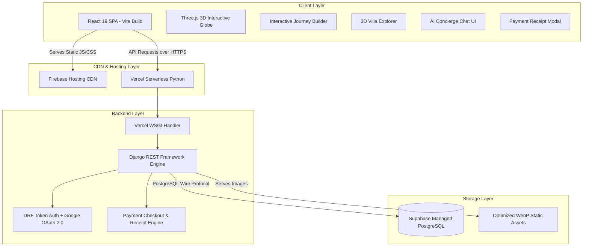

# Sandeep Luxury Resorts — Technical Project Documentation 🏝️

Welcome to the comprehensive technical documentation for the **Sandeep Luxury Resorts Platform**.

---

## 📌 Executive Overview

**Sandeep Luxury Resorts** is an ultra-luxury full-stack hospitality and resort management platform. It offers high-end travelers an immersive digital experience featuring 3D WebGL globes, virtual villa explorers, step-by-step custom journey builders, AI concierge chat, dynamic dark/light luxury theme toggling, real-time reservations, and integrated payment processing with digital receipt generation.

### Live Stack Architecture
- **Frontend Application:** Vite + React 19 + TypeScript + Three.js + GSAP + Tailwind CSS
- **Backend API Service:** Django 3.2 + Django REST Framework + WhiteNoise Serverless Middleware
- **Database Engine:** Supabase Managed Cloud PostgreSQL (Production) / SQLite3 (Local Development)
- **Deployment Infrastructure:** **Firebase Hosting** (Frontend) & **Vercel** (Backend Serverless)

---

## 🏛️ System Architecture

---

## 🗄️ Database Schema & Data Models

### 1. `Resort` Model
Represents luxury resort destinations (e.g. Maldives, Bali, Kyoto, Swiss Alps, Rajasthan).

| Field Name | Type | Constraints / Choices | Description |
|---|---|---|---|
| `id` | `BigAutoField` | Primary Key | Unique resort ID |
| `name` | `CharField(200)` | — | Resort display title |
| `slug` | `SlugField(100)` | `unique=True, null=True, blank=True` | URL-friendly identifier |
| `location` | `CharField(200)` | — | Geographical location string |
| `region` | `CharField(100)` | Choices: `asia`, `europe`, `africa`, `americas`, `oceania`, `all` | Global geographical region |
| `description` | `TextField` | — | Detailed narrative description |
| `tagline` | `CharField(300)` | `null=True, blank=True` | Luxury subtitle headline |
| `rating` | `FloatField` | `default=5.0` | Star/guest rating (e.g. `4.98`) |
| `priceStart` | `DecimalField` | `max_digits=10, decimal_places=2` | Starting price per night |
| `image` | `ImageField` | `upload_to='images/'` | Cover image path |
| `inclusions` | `TextField` | `default='[]'` | JSON-serialized array of resort inclusions |

### 2. `Room` Model
Represents individual luxury villas, overwater bungalows, and suites.

| Field Name | Type | Description |
|---|---|---|
| `id` | `BigAutoField` | Primary Key |
| `resort` | `ForeignKey(Resort)` | Parent resort relationship (`related_name='rooms'`) |
| `room_type` | `CharField(100)` | Villa title (e.g. `Overwater Sunset Pool Villa`) |
| `price` | `DecimalField` | Nightly reservation rate |
| `is_available` | `BooleanField` | Availability state (default `True`) |
| `image` | `ImageField` | Exterior villa preview image |
| `interior_image` | `ImageField` | Interior room view image |

### 3. `Service` Model
Represents spa treatments, fine dining, and curated guest experiences.

| Field Name | Type | Constraints / Choices | Description |
|---|---|---|---|
| `id` | `BigAutoField` | Primary Key | — |
| `resort` | `ForeignKey(Resort)` | `null=True, blank=True` | Associated resort (`related_name='services'`) |
| `name` | `CharField(100)` | — | Service name |
| `category` | `CharField(50)` | Choices: `wellness`, `dining`, `experiences`, `general` | Categorization tag |
| `description` | `TextField` | — | Detailed service description |
| `image` | `ImageField` | `upload_to='images/'` | Service image asset |

### 4. `Booking` Model
Represents guest reservations with payment tracking.

| Field Name | Type | Constraints / Choices | Description |
|---|---|---|---|
| `id` | `BigAutoField` | Primary Key | Unique booking ID |
| `user` | `ForeignKey(User)` | — | Guest user relationship |
| `room` | `ForeignKey(Room)` | — | Reserved room/villa |
| `start_date` | `DateField` | — | Check-in date |
| `end_date` | `DateField` | — | Check-out date |
| `guests` | `IntegerField` | `default=2` | Number of guests |
| `special_requests` | `TextField` | `blank=True, default=''` | Guest preferences |
| `status` | `CharField(20)` | Choices: `confirmed`, `cancelled`, `completed` | Booking status |
| `payment_status` | `CharField(20)` | Choices: `pending`, `paid`, `failed`, `refunded` | Payment status |
| `payment_method` | `CharField(50)` | Choices: `card`, `upi`, `netbanking`, `razorpay`, `express_concierge` | Payment channel |
| `payment_id` | `CharField(100)` | `blank=True, default=''` | Payment transaction ID |
| `paid_at` | `DateTimeField` | `null=True, blank=True` | Payment confirmation timestamp |
| `total_price` | `DecimalField` | `max_digits=10, decimal_places=2` | Total booking price |
| `created_at` | `DateTimeField` | `default=timezone.now` | Booking creation timestamp |

### 5. `Inquiry` Model
Represents guest contact and reservation inquiry submissions.

| Field Name | Type | Description |
|---|---|---|
| `id` | `BigAutoField` | Primary Key |
| `name` | `CharField(200)` | Guest full name |
| `email` | `EmailField` | Guest contact email |
| `phone` | `CharField(50)` | Contact phone number |
| `resort` | `CharField(200)` | Destination of interest |
| `subject` | `CharField(300)` | Inquiry topic |
| `message` | `TextField` | Message body |
| `created_at` | `DateTimeField` | Submission timestamp |

### 6. `NewsletterSubscriber` Model
Stores email subscriptions for luxury travel news.

| Field Name | Type | Description |
|---|---|---|
| `id` | `BigAutoField` | Primary Key |
| `email` | `EmailField(unique=True)` | Subscriber email address |
| `subscribed_at` | `DateTimeField` | Subscription timestamp |

### 7. `Banner` Model
Manages dynamic page header banner content and images.

| Field Name | Type | Description |
|---|---|---|
| `id` | `BigAutoField` | Primary Key |
| `page` | `CharField(100, unique=True)` | Page key (e.g. `home_hero`, `villas_hero`, `wellness_hero`) |
| `title` | `CharField(200)` | Custom banner title |
| `subtitle` | `CharField(300)` | Custom banner subtitle |
| `image` | `ImageField` | Custom banner background image |

---

## 🧹 Automated Media Cleanup Signals

To prevent disk bloat and orphan files, `backend/api/models.py` attaches pre-save and post-delete signal listeners to all models with image fields (`Resort`, `Room`, `Service`, `Banner`).

- **On Delete:** Deletes the corresponding `.webp`/image file from the storage directory.
- **On Update/Replace:** Automatically removes the previous image file when a user uploads a new image.
- **System Safeguard:** Shared default asset files (e.g. `maldives.png`, `service1.png`) are protected from accidental file system deletion.

---

## 📡 REST API Reference

### Base URLs
- **Local Development:** `http://127.0.0.1:8000/api/`
- **Production Serverless:** `https://<your-vercel-domain>.vercel.app/api/`

### Complete Endpoint Directory

| Method | Endpoint | Auth Required | Description |
|---|---|:---:|---|
| `POST` | `/api/register/` | ❌ | Register user account |
| `POST` | `/api/login/` | ❌ | Login user & return DRF token |
| `POST` | `/api/google-login/` | ❌ | Google OAuth 2.0 sign-in |
| `GET` | `/api/profile/` | ✅ | Get user profile & booking history |
| `GET` | `/api/resorts/` | ❌ | List all luxury resort destinations |
| `GET` | `/api/resorts/{slug}/` | ❌ | Get resort detail by slug |
| `GET` | `/api/rooms/` | ❌ | List luxury suites & villas |
| `GET` | `/api/services/` | ❌ | List wellness & dining services |
| `GET` | `/api/banners/` | ❌ | Fetch dynamic header banners |
| `GET` | `/api/bookings/` | ✅ | List user reservations |
| `POST` | `/api/bookings/` | ✅ | Create new resort reservation |
| `PATCH` | `/api/bookings/{id}/` | ✅ | Modify or cancel reservation |
| `POST` | `/api/concierge/` | ❌ | AI Concierge chat assistant query |
| `POST` | `/api/inquiries/` | ❌ | Submit guest contact inquiry |
| `POST` | `/api/subscribe/` | ❌ | Newsletter subscription |
| `POST` | `/api/payments/create-session/` | ✅ | Create payment checkout session |
| `POST` | `/api/payments/confirm/` | ✅ | Confirm payment & complete booking |
| `GET` | `/api/payments/receipt/{booking_id}/` | ✅ | Retrieve digital payment receipt payload |

---

## 🎨 Interactive Frontend Architecture & UI Components

1. **Interactive 3D Globe (`interactive-globe.tsx`)**:
   - Developed using **Three.js** and **React Three Fiber**.
   - Custom sphere mesh with landmass texture shaders, interactive resort location markers, hover tooltips, and smooth camera rotations.

2. **Villa Explorer (`villa-explorer.tsx`)**:
   - Interactive villa browser with filterable views by price, capacity, and region.
   - Dual-view image switchers (Exterior vs. Interior) with glassmorphism UI overlay.

3. **Custom Journey Builder (`journey-builder.tsx`)**:
   - Multi-step interactive flow allowing guests to customize resort selection, villa choice, wellness treatments, yacht charters, and private dining options.

4. **AI Concierge Assistant (`concierge-chat.tsx`)**:
   - Floating dynamic chat drawer providing 24/7 AI-driven guest assistance, custom itinerary suggestions, and villa recommendations.

5. **Payment Gateway & Receipt Modal (`payment-receipt-modal.tsx`)**:
   - Checkout flow with card / UPI / express pay support.
   - Interactive digital receipt modal with transaction reference IDs, itemized cost breakdown, and print/download actions.

6. **Theme Context (`ThemeContext.tsx` & `theme-toggle.tsx`)**:
   - Dark and Light theme switching with localStorage state persistence and CSS variable integration.

---

## 🚀 Multi-Cloud Deployment Guide Summary

For complete step-by-step instructions on deploying the full stack across Supabase, Vercel, and Firebase Hosting, see [`docs/DEPLOYMENT_GUIDE.md`](./DEPLOYMENT_GUIDE.md).

---

## 📄 License & Attribution

This documentation is maintained by **Sandeep Luxury Resorts** under the [MIT License](../LICENSE).
